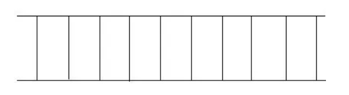

# 1. C 언어가 뭐야?

* 컴퓨터는 0과 1 밖에 모르기 때문에 컴퓨터에게 명령을 내리기 위해서는 **컴파일** 이라는 과정을 통해서 사용자가 입력한 코드를 변환해야 한다. 이를 수행하는 프로그램을 **컴파일러** 라고 한다.


# 2. 맛보기

## 2-1. C 언어 본격 맛보기

```c
#include <stdio.h>
int main() {
    printf("Hello, World!\n");
    return 0;
}
```

```c
# include <stdio.h>
```

* `stdio.h`라는 파일을 포함하고자 하는 것

```c
int main()
```

* `int`=`integer` , `main`은 함수를 호출한 것
* 정수형을 반환하는 main 함수 `{}`의 안에 하고자 하는 명령어를 입력한다.

```c
printf("Hello, World!\n!");
```

* 화면에 글자를 출력하는 것은 운영체제에 자신이 화면에 글자를 뿌려야 한다는 메시지 전송
* 운영체제는 하드웨어에 이를 출력한다는 것을 전달
* `stdio(STandard Input Output header): 표준 입출력 헤더` 
  * 입출력에 관련된 것을 담당
* `\n`: 개행문자
* `;`  문단의 마지막에 반드시 입력

```c
return 0;
```

* 운영체제에 0을 반환
* 0 이외의 값은 오류가 발생했다는 것을 전달하는 의미

### 주석(comment)

```c
/* 여러 줄을 쓸 수 있는 주석 */
// 한 줄에 나타내는 주석
```


## 2-3. 수를 표현하는 방법

* **기수법(Number system)**
* **십진법(Decimal)**
* **이진법(Binary)**
* 이진법 -> 16진법: 4자리씩 끊어서 16진법으로 변환
* 16진법 -> 이진법: 1자리를 이진법으로 변환해서 연결
* **메모리**: 휘발성 메모리인  `RAM`을 의미함. 데이터를 랜덤하게 접근 가능해 속도가 빠름.
* `비트(Bit)`: 이진수 한 자리를 의미
* `바이트(Byte)`: 8개의 bit의 묶음, 0~255 까지의 256개의 숫자를 표현 가능
* `레지스터(resister)`: 컴퓨터에서 연산을 담당하는 CPU의 메모리 공간, 레지스터의 크기는 컴퓨터 상에서 연산이 실행되는 최소 단위를 의미하며 이 크기를 `워드(Word)`라고 한다. 64 비트 컴퓨터의 경우 8 바이트가 1 워드가 된다.


# 3. 변수가 뭐지?

* 컴퓨터는 `RAM`에 데이터를 기억한다. 다음과 같이 그림으로 표시함.



* 컴퓨터는 각 방에 단순한 숫자로 이름을 정한다. (ex. 0, 1, 2 ...)
* 32 비트 CPU에서는 최대 2**32개(4GB)- 총 42억개에  달하는 방을 가질 수 있음.
* 32 비트 숫자를 2진법이나 10진법으로 표기하기 어렵기 때문에 16진법으로 주소값을 표시함.


* `변수(Variable)`: 바뀔 수 있는 어떤 값을 보관하는 곳

```c
/* 변수 선언하기 */
#include <stdio.h>
int main() {
    int a;
    a = 10;
    printf("a의 값은 : %d", a);
    return 0;
}
```

```bash
a의 값은 : 10
```

* `int a`:  a 에 int 형 자료형을 저장한다는 의미, -2147483648 에서 2147483647 까지의 정수 보관, 범위를 초과하는 숫자를 저장 불가능


* 위 표는 더 큰 숫자를 저장하는 방법을 나타낸다.

```c
/* 변수 알아보기2 */
#include <stdio.h>
int main() {
    int a = 127;
    printf("a의 값은 %d 진수로 %o 입니다.", 8, a);
    printf("a의 값은 %d 진수로 %d 입니다.", 10, a);
    printf("a의 값은 %d 진수로 %x 입니다.", 16, a);
    return 0;
}
```

``` bash
a의 값은 8 진수로 177 입니다.
a의 값은 10 진수로 127 입니다.
a의 값은 16 진수로 7f 입니다.
```

* 실수형 변수
  * `float`, `double`

```c
/* 변수 알아보기3 */
#include <stdio.h>
int main() {
    float a = 3.141595f;
    double b = 3.141595;
    printf("a : %f\n", a);
    printf("b : %f\n", b);
    return 0
}
```

```bash
a : 3.141595
b : 3.141595
```

```c
float a = 3.141595f;
double b = 3.141595;
```

* `float` 형은 f를 붙이지 않으면 `double`  형으로 식하여 문제가 생길 수도 있음.

```c
printf("a : %f\n", a);
printf("b : %f\n", b);
```

* `%f` : 실수형 변수를 출력하는 형식

```c
printf("%f", 1); // 0이 출력
printf("%f", 1.0); // 1.0이 출력    
```

```c
/* printf 형식 */
#include <stdio.h>
int main() {
    float a = 3.141592f;
    double b = 3.141592;
    int c = 123;
    printf("a : %.2 \n", a); // a : 3.14
    printf("b : %5d \n", b); // b :   123
    printf("c : %6.3f \n", c); // c :  3.142
    return 0;
}
```

* `%.2` : 소수 점 둘째 자리 까지만 출력. ex) %.100f >> 3.1415920000......00 을 표시함
* `%5d`: 숫자의 자리수를 되도록이면 5자리로 맞춰라. 숫자가 5자리가 넘어가면 활성화 되지 않음.
* `%6.3f`: 앞의 두개의 경우를 아우르는 형식


# 4. 계산하기

* 산술연산자(Arithmetic Operator) : `+`, `-`, `*`, `/`, `%`
* `=`은 뒤에서 부터 해석한다. 따라서 다음 코드는 같은 코드가 된다.

```c
a = 5;
b = 5;
c = 5;
d = 5;
```

```c
a = b = c = d = 5;
```

* `%%`는 `%` 표시를 표현하기 위한 방법, 하나로는 `%d`, `%f`와 같이 사용될 수 있기 때문

```c
#include <stdio.h>
int main() {
    int a = 10;
    double b = 3;
    printf("%f", a / b);
    printf("%f", b / a);
    return 0;
} 
```

* 위의 코드에서 a와 b의 자료형이 다름에도 오류없이 출력이 가능하다. 그 이유는 컴파일러가 **산술 변환**이라는 과정을 거치기 때문이다. 어떠한 자료형이 다른 두 변수를 연산할 때, 숫자의 범위가 큰 자료형으로 자료형들이 바뀜

* `전위형(prefix) : ++c` 1을 먼저 더해준 후 결과를 반환
* `후위형(postfix) : c++` 결과를 반환한 후 1을 더해줌


* 비트 연산자
* `&(And)`, `|(or)`, `^(Xor)`, `>>, << (shift)`, `~ (반전)`
* `&` : 하나라도 0이면 0
* `|`: 하나라도 1이면 1
* `^`: 두 수가 다르면 1
* 만약 a가 1일 때, `a << 1`은 10이 된다.
* `~` 반전하는 경우 int 자료형의 경우 32자리의 2진수를 나타낼 수 있기 때문에 그 앞에 0 이었던 숫자들이 1로 바뀌게 된다.

