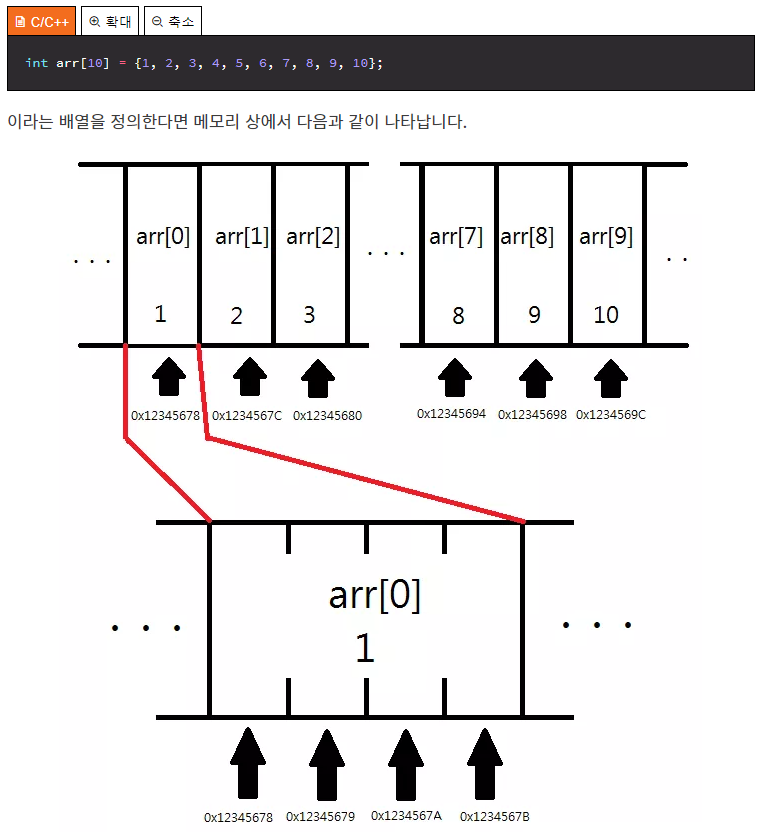

# 12. 포인터

* 특정한 데이터가 저장된 주소값을 보관하는 변수
* 포인터의 정의
  * `(포인터에 주소값이 저장되는 데이터의 형) *(포인터의 이름);`
  * `(포인터에 주소값이 저장되는 데이터의 형)* (포인터의 이름);`

```c
int* p;
int *p;
```

```c
/* & 연산자 */
#include <stdio.h>
int main() {
    int a;
    a = 2;
    
    print("%p \n", &a);
    return 0;
}
```

```bash
0X7fff80505b64
```

* `&a`의 값을 `%p` 16진수 형태로 출력하라고 명령
* `*` 연산자 : 포인터를 포인터에 저장된 주소값에 위치한 데이터로 생각

```c
/* * 연산자 */
#include <stdio.h>
int main() {
    int *p;
    int a;
    
    p = &a;
    a = 2;
    
    printf("a의 값 : %d\n", a);
    printf("*p의 값 : %p\n", *p);
    return 0;
}
```

```bash
a의 값 : 2
*p의 값 : 2
```


```c
/* * 연산자 */
#include <stdio.h>
int main() {
    int *p;
    int a;
    
    p = &a;
    *p = 3;
    
    printf("a의 값 : %d\n", a);
    printf("*p의 값 : %p\n", *p);
    return 0;
}
```

```bash
a의 값 : 3
*p의 값 : 3
```

* 포인터에는 변수가 차지하는 모든 메모리 주소들의 위치가 들어 있는 것이 아니라 **시작주소**만 들어가 있다.  따라서 포인터에 해당하는 변수의 형을 지정해주어야 함.
* 상수 포인터

```c
/* 상수 포인터 */
#include <stdio.h>
int main() {
    int a;
    int b;
    const int* pa = &a; // int 형 변수를 가리키는데 그 값을 절대로 변경하지 말라. 따라서 *pa가 안 바뀐다는 말임. 하지만 a는 바뀔 수 있음
    *pa = 3; // 올바르지 않은 문장
   	a = 3; // 올바른 문장
    pa = &b; // 올바른 문장
    return 0;
}
```

```c
// 상수 포인터
#include <stdio.h>
int main() {
    int a; int b;
    int* const pa = &a; // pa가 바뀔 수 없다. *pa는 상관없음.
    
    *pa = 3; // 따라서, 이건 옳은 표현
    pa = &b; // 이건 틀린 표현이다.
    
    return 0;
}
```

* 포인터의 덧셈

```c
// 포인터의 덧셈
#include <stdio.h>
int main() {
    int a;
    int* pa = &a;
    
    printf("pa의 값 : %p \n", pa); // pa가 출력된다.
    printf("(pa + 1)의 값 : %p \n", pa + 1); // int형의 크기인 4바이트가 증가한다.
    // pa 가 어떤 형의 변수 주소 값을 참조함에 따라 1을 더했을 때 각 형에 크기에 해당되는 값이 더해진다. ex) char >> 1바이트, double >> 8바이트
    
    return 0;
} // 뺄셈도 이와 동일하다.
```

* 포인터 끼리의 덧셈은 필요가 없다. 하지만 포인터 끼리의 뺄셈은 중요한 역할을 한다고 한다. 그 이유는?



* 위와 같은 배열의 특징을 이용해 배열의 특정 위치에 접근이 가능하다. `pa + (원하는 위치)`를 하면 연산 결과가 각 배열값들의 주소를 가리키기 때문이다.
* 즉, `pa+(원하는 위치)`는 실제로 `pa+(원하는 위치)*(배열 값의 형에 크기)`와 같은 연산을 수행한다.

```c
// 배열을 그대로 출력하면?
#include <stdio.h>
int main() {
    int arr[3] = {1, 2, 3};
    printf("%p", arr); // arr[0]의 주소 값이 출력된다.
    return 0;
}
```

* 배열의 이름이 배열의 첫 번째 원소를 가리키는 포인터는 **아니다**.

```c
#include <stdio.h>
int main() {
    int arr[3] = {1, 2, 3};
    int* p = &arr;
    
    printf("arr의 크기는 : %d\n", sizeof(arr)); // 12
    printf("arr를 가리키는 포인터의 크기는 : %d", sizeof(p)); // 8
}
// 따라서 배열의 이름과 배열을 가리키는 포인터는 엄연히 다르다.
```

* c언어 상에서 배열의 이름이 sizeof 연산자나 주소값 연산자(`&`)와 사용될 때의 경우를 빼면, 배열의 이름을 사용시 암묵적으로 첫 번재 원소를 가리키는 포인터로 타입 변환되기 때문이다.

* `[]` 연산자의 역할

```c
// [] 연산자
#include <stdio.h>
int main() {
    int arr[3] = {1, 2, 3};
    
    printf("arr[3] : %d \n", arr[3]); // *(arr + 3) 의 연산을 수행함. 따라서 다음과 같은 연산도 수행이 가능하다.
    pritnf("3[arr] : %d \n", 3[arr]); // 이것은 *(3 + arr) 를 의미한다.
    printf("*(arr+3) : %d \n", *(a + 3)); // arr가 arr[0]의 포인터를 가리키므로 포인터 연산이 수행 가능함.
    
    return 0;
}
```


* 생각해 볼 문제

```c
int arr[3][3]; 과 같은 배열은 내부적으로 어떻게 처리되는지 생각해보기.
    // *((arr + 3) + 3)
int* arr[3]; 과 같은 배열이 가지는 의미는 무엇인가?
    // int*(int 포인터) 3개 짜리 배열을 의미한다. 즉, 포인터 배열을 의미함.
```

---


