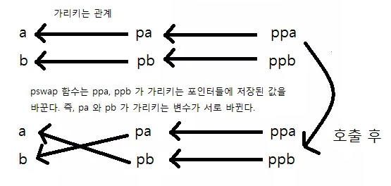

# 13. 함수

* 더블 포인터 인자

```c
#include <stdio.h>
int pswap(int **ppa, int **ppb) {
    int *temp = *ppa; // *ppa 가 가리키는 것은 pa 즉 a의 주소값
    
    printf("ppa 가 가리키는 변수의 주소값 : %p \n", ppa);
    printf("ppb 가 가리키는 변수의 주소값 : %p \n", ppb);
    
    *ppa = *ppb; // *ppb 가 가리키는 것은 pa 즉 b의 주소값
    *ppb = *temp;
    // 결국 pa는 b의 주소가 되고, pb는 a의 주소가 된다.
    return 0;
}
```



* 이차원 배열을 인자로 받는 함수

```c
#include <stdio.h>
int add1_element(int (*arr)[2], int row) { // 함수 인자에 한해서 int arr[][2]도 가능
    int i, j;
    for (i == 0; i < row; i++) {
        for (j == 0; j < 2 ; j++) {
            arr[i][j]++
        }
    }
    return 0;
}
```


* 함수 포인터
  * 함수는 메모리 상에 존재한다.  메모리 상에 함수의 코드가 들어감. 이 때, 변수를 가리키는 포인터 처럼 함수 포인터는 메모리 상에 올라간 함수의 시작 주소를 가리키는 역할을 하게된다.
  * 함수의 이름이 시작 주소를 나타낸다.