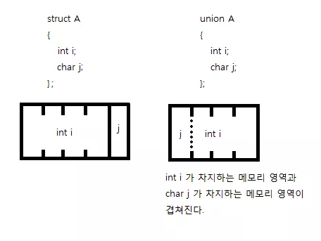

# 구조체

```c
#include <stdio.h>
struct Human { // 구조체 선언
    int age; int height; int weight;
}; // ; 붙여주는거 명심
int main() {
    struct Human Psi; // 구조체 생성
    Psi.age = 10; Psi.height = 130; Psi.weight = 24; // 멤버(member) 대입
}
```

* python과 달리 구조체에서는 변수를 초기화 할 수 없다.

```c
struct Human human_list[3]; // 배열 지정 가능
```

* 구조체 포인터

```c
struct Human *human; // struct Human 부분이 int나 char 지정해준것과 같음 (타입)
```

* `->`

```c
#include <stdio.h>
struct test {
    int a, b;
};
int main() {
    struct test st;
    struct test *pst;
    pst = &st;
    pst->a = 1; // (*pst).a 와 같음
    pst->b = 2; // (*pst).b 와 같음
} 
```

```
char str[10] = "hello"; 이 형태는 배열 선언시에만 *예외적으로* 허용되는 문법입니다. 

char str[10] = "hello";  는 괜찮지만

char str[10];
str = "hello"; 은 안되요!

=============================

scanf_s 함수를 사용 하려면 받는 인자, 크기를 번갈아가면써 써야 합니다. 즉;

scanf_s("%s%s%s", book_list[i].name, 30, book_list[i].auth, 30, book_list[i].publ, 30 );
```

* c 에서는 구조체 안에 함수를 정의할 수 없음.


```c
// 헷갈림
#include <stdio.h>
struct TEST {
    int c;
    int *pointer;
};
int main() {
    struct TEST t;
    struct TEST *pt = &t;
    int i = 0;
    
    t.pointer = &i; // t.pointer가 향하는 주소는 i 이다.
    
    *t.pointer = 3; // *(t.pointer) 가 되어 i에 3을 대입한다.
    
    *pt->pointer = 4; // -> 이것은 *((*pt).pointer) 가 되어 
    				  // i에 4를 대입한다. -> 가 * 보다 우선순위가 높음 
    return 0;
}
```

* 구조체의 대입

```c
#include <stdio.h>
struct TEST {
    int i; char c;
};
int main() {
    struct TEST st, st2;
    st.i = 1; st.c = 's';
    st2 = st; // 이것도 가능
    return 0;
}
```

* 함수에서 사용하기 위해서는 구조체 포인터를 대입하여야 한다.

```c
#include <stdio.h>
struct employee {
    int age; int salary;
};
struct company {
    struct employee data;
    char name[10];
};
int main() {
    struct company Kim;
    Kim.data.age = 10; Kim.data.salary = 100;
    
    return 0;
}
```

* 구조체 안에 멤버가 구조체여도 상관 없음.
* 하나의 타입으로 분류되기 때문에 함수의 반환형에도 사용가능하다.

```c
struct A {
    ...;
} AA;

struct A AA = { 타입이 섞여도 됨 순서만 맞으면 상관 없음 };

struct A {
    ...;
} AA = { ... };
```

* 구조체를 초기화 하는 방법


## 공용체(union)

* 구조체와는  달리 메모리를 공유함



* 위치를 공유하기 때문에 각 멤버의 크기에 따라 다른 멤버의 크기가 결정된다.
* 빅 엔디안 : 낮은 주소값에 상위 비트를 적는 방식
* 리틀 앤디안 : 높은 주소값에 상위 비트를 적는 방식


```c
#include <stdio.h>
union A {
    int i; char j;
};
int main() {
    union A a;
    a.i = 0x12345678;
    print("%x", a.j);
    return 0;
}
```

* 대부분의 컴퓨터가 리틀앤디안 방식을 취하기 때문에 다음에서는 78이 출력된다. (char의 크기는 1바이트 이므로)
* 만약, j를 short(2바이트)로 바꾼다면 5678로 출력된다. 컴퓨터는 리틀앤디안으로 저장된다는 것을 알기 때문에 이를 적절하게 변환시켜서 출력시키기 때문


## 열거형(enum)

```c
// 열거형의 도입
#include <stdio.h>
eunm { RED, BLUE, WHITE, BLACK }; // 컴파일러에서 RED=0, BLUE=1, WHITE=2, BLACK=3
							      // 과 같이 정수값을 매겨준다.
int main() {
    int palette = RED;
    switch (palette) {
        case RED: printf("palette : RED \n"); break;
        case BLUE: printf("palette : BLUE \n"); break;
        case WHITE: printf("palette : WHITE \n"); break;
        case BLACK: printf("palette : BLACK \n"); break;
    }
    return 0;
}
```


