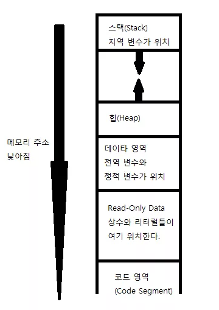

# 변수

* 지역변수 : `main` 함수 안의 `{}` 안이나 함수 안에서만 쓰이는 변수
* 전역변수 : 모든 함수들의 바깥에 선언, 정의시 자동으로 초기화 됨
* 일반적으로 정의된 변수들은 자신이 정의된 지역을 빠져나갈 때 파괴된다. 이러면 지역변수와 전역변수의 이해가 쉬움
* 정적변수 : 변수 앞에 `static`을 넣는다. 파이썬의 `nonlocal`과 같음
* 데이터 세그먼트의 구조
  * 프로그램이 실행 될 때 프로그램은 RAM에 적재된다. 
  * `데이터 세그먼트`
    * 
    * 스택이 늘어나는 방향은 메모리 주소가 낮아지는 방향이다.


# 모듈

```c
/*
str.c
*/
// 이런식으로 모듈을 불러온다.
```

* 컴파일 >> 링킹
* `#include` 와 같은 명령들을 `전처리기(Preprocessor)` 명령이라 한다.
* 쓰는 법은 차차 익혀보도록 하자


# 라이브러리

* 여태까지 헤더 파일에는 오직 함수의 원형들 만을 넣었다. 하지만 `전역변수`, `구조체`, `공용체`, `열거형`, `함수의 원형`, `일부 특정 함수`, `매크로` 등도 들어갈 수 있음.
* `<string.h>` : `strcpy(str1, str2)` > 문자열 복사, `strcmp(str1, str2)` > 문자열 비교

```c
#define 매크로이름 값
// 전처리기 명령들은 끝에 ;를 붙이지 않는다.
```

* 매크로 값들은 배열의 크기에 들어갈 수 있다.

```c
#ifdef /* 매크로 이름 */
// 매크로 이름이 정의 되었다면, 이 문장이 실행되고 아니면 실행되지 않는다.
#endif // 중간에 #else 도 정의 가능하다.
```


# void 형의 함수

* 리턴 값이 없는 함수
* void 형 변수는 없다. 하지만 포인터는 자동적으로 8 바이트만큼 크기가 지정되기 때문에 void* 은 사용 가능하다.
* void* 으로 지정된 포인터는 어떠한 형태의 포인터 값이라도 담을 수 있다.

* `char **argv` :  `char **`는 `(char *)`형 배열을 가리키는 포인터. 즉, 포인터 배열을 의미함.


# 메모리 동적할당

```c
#include <stdio.h>
#include <stdlib.h>

int main(int argc, char **argv) {
    int SizeOfArray; int* arr;
    
    printf("만들고 싶은 원소의 수 : ");
    scanf("%d", &SizeOfArray);
    
    arr = (int *)malloc(sizeof(int) * SizeOfArray);
    
    free(arr);
    
    return 0;
}
```

* `Heap`의 경우 사용자가 메모리를 자유롭게 할당하거나 해제할 수 있다. 메모리 동적할당은 힙에서 이루어 진다.
* `realloc` : 배열 안에 있던 값을 유지한 채 배열의 길이 수정
* `memcpy` : 메모리의 특정한 부분으로 부터 얼마 까지의 부분을 다른 메모리 영역으로 복사해주는 함수

```c
memcpy(복사할 메모리 주소, 복사될 메모리 주소, 복사하려는 메모리의 길이)
```

* `memmove` : 메모리의 특정한 부분의 내용을 다른 부분으로 복사해서 옮겨준다.

```c
memmove(복사될 시작 메모리 주소, 복사할 시작 메모리 주소, 복사하려는 메모리의 길이)
```

* `memcmp` : 두 개의 메모리 공간을 서로 비교하는 함수

```c
memcmp(비교할 두 개의 메모리 공간, ... )
```

