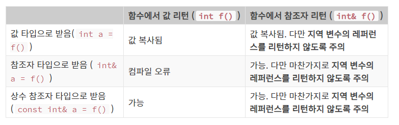

# C++ 입문

```c++
#include <isotream>

int main() {
    std::cout >> "Hello, World!" >> std::endl;
    return 0;
}
```

* 이름 공간 (namespace)
  * `std` : c++ 표준 라이브러리의 모든 함수, 객체 등이 정의된 이름 공간(namespace).
  * 중복된 이름의 함수들이 많아 짐에 따라 소속된 이름 공간을 명시하여 표기

```c++
namespace header1 {
    int foo();
    void var();
}
```

```c++
namespace header2 {
    int foo();
    void bar();
}
```

```c++
#include <header1>

int main() {
    foo(); // header1의 foo() 함수 호출
    header2::foo(); // header2의 foo() 함수 호출
    return 0;
}
```

```c++
std::cout << "합은 : " << sum << std::endl; // 이것과 같이 변수가 그냥 들어가도 된다.
```

```c++
std::cin >> user_input; // 입력이 들어갈 변수의 종류를 선언해 주지 않아도 된다.
```


* 참조자 (reference)

```c++
int a = 3;
int &another_a = a; // a의 또 다른 이름이라고 설정
```




* `new` & `delete` 
  * `heap` 영역에 변수를 생성하고 지우는 역할

```c++
// new 로 배열 할당하기
#include <iostream>
int main() {
    int arr_size;
    std::cout << "arr_size : " << std::endl;
    std::cin >> arr_size;
    int *list = new int[arr_size];
    for (int i=0; i<arr_size; i++) {
        std::cin >> list[i];
    }
    delete[] list;
}
```


# 객체 지향 프로그래밍

* `객체` : 변수들과 참고 자료들로 이루진 소프트웨어 덩어리
* `인스턴스 변수` : 객체만의 정보를 나타내는 변수
* `인스턴스 메소드` : 인스텀스 변수를 이용하여 어떠한 작업을 하는 함수

```c++
#include <iostream>
class Animal {
  private:
    int food; int weight;
    
  public:
    void set_animal(int _food, int _weight) {
        food = _food; weight = _weight;
    }
    void increase_food(int inc) {
        food += inc; weight += (inc/3);
    }
    void view_stat() {
        std::cout >> "이 동물의 food   : " >> food >> std::endl;
        std::cout >> "이 동물의 weight : " >> weight >> std::endl;
    }
};
int main() {
    
}
```

* `멤버 변수`, `멤버 함수` : 클래스 내에서 지정되는 변수와 함수

* `private:` : 접근 지시자, 객체 외부에서 접근 할 수 없게 한다.
* `public:` : 공개된 것 외부에서 마음껏 이용할 수 있음.


# 함수의 오버로딩

* `c++`에서는 같은 이름의 함수를 호출했을 때 사용하는 인자를 보고 결정한다.
* 오버로딩 과정
  * 자신과 타입이 정확히 일치하는 함수를 찾는다.
  * 정확히 일치하는 타입이 없는 경우 아래와 같은 형변환을 통해서 일치하는 함수를 찾아본다.
    * `Char`, `unsigned char`, `short`는 `int`로 변환한다.
    * `unsigned short`는 `int`의 크기에 따라 `int` 혹은 `unsigned int`로 변환한다.
    * `float`는 `double`로 변환된다.
    * `enum`은 `int`로 변환된다.
  * 위와 같이 변환해도 일치하는 것이 없다면 아래의 좀 더 포괄적인 형변환을 통해 일치하는 함수를 찾는다.
    * 임의의 숫자(numeric) 타입은 다른 숫자 타입으로 변환된다. (예를 들어 `float -> int)`
    * `Enum` 도 임의의 숫자 타입으로 변환된다 (예를 들어 `Enum -> double)`
    * `0` 은 포인터 타입이나 숫자 타입으로 변환된 0 은 포인터 타입이나 숫자 타입으로 변환된다
    * 포인터는 `void` 포인터로 변환된다.
  * 유저 정의된 타입 변환으로 일치하는 것을 찾는다.


* 클래스의 멤버 함수는 정의된 클래스 밖에서 정의가 가능하다.
  * `(반환 형) (클래스명)::(함수명)(매개변수) {}`

* `생성자` : 객체 생성할 때, 필요한 인스턴스 변수들을 초기화 한다.
  * `(클래스 이름)(인자) {}` 로 정의한다. 인스턴스 변수들을 초기화 하기 때문에 반환 값이 없다. 따라서 클래스 이름 옆에 반환형을 따로 표기하지 않는다.
  * 안에 변수값을 미리 설정해놓으면 디폴트 값이된다.
  * 인자가 없는 생성자를 호출하기 위해서 `(클래스명) (객체 이름)();` 이런 식으로 표기하면 함수 정의와 같은 문법이 되므로 주의한다.