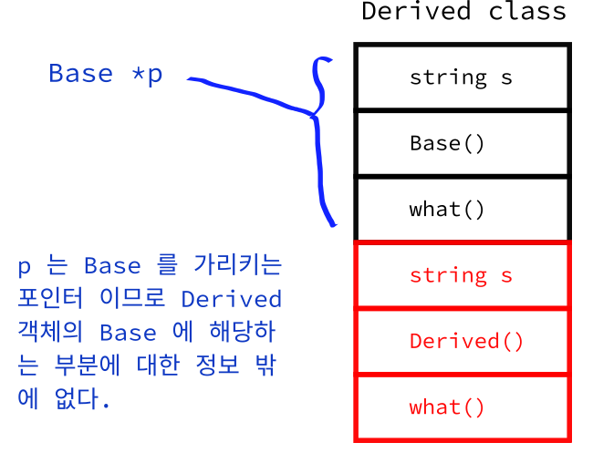

# 오버라이딩

```c++
#include <iostream>
#include <string>

class Base {
	std::string s;
    
  public:
    Base() : s("base") {std::cout << "Base Class" << std::endl;}
    void what() {std::cout << s << std::endl;}
};
class Derived : public Base {
    std::string s;
  public:
    Derived : Base(), s("derived") {std::cout << "Derived Class" << std::endl;}
    void what() {std::cout << s << std::endl;}
}

int main() {
    std::cout << "기반 클래스 생성" << std::endl;
    Base p;
    
    p.what();
    
    std::cout << "파생 클래스 생성" << std::endl;
    Derived c;
    
    c.what();
    
    return 0;
}
```

```bash
기반 클래스 생성
Base Class
base
파생 클래스 생성
Base Class
Derived Class
derived
```


```c++
// 코드 변형
#include <iostream>
#include <string>

class Base {
	std::string s;
    
  public:
    Base() : s("base") {std::cout << "Base Class" << std::endl;}
    void what() {std::cout << s << std::endl;}
};
class Derived : public Base {
    std::string s;
  public:
    Derived : Base(), s("derived") {std::cout << "Derived Class" << std::endl;}
    void what() {std::cout << s << std::endl;}
}

int main() {
    Base p;
    Derived c;
    
    std::cout << "==== 포인터 버젼 ====" << std::endl;
    Base* p_c = &c;
    p_c->what(); // (*p_c).what()
    
    return 0;
}
```

```shell
Base Class
Base Class
Derived Class
==== 포인터 버젼 ====
기반
```

* 파생된 클래스는 기초 클래스의 파생이므로 파생 클래스 변수의 주소를 기초 클래스의 포인터 변수로 지정하면, 파생 클래스에 추가된 멤버 변수들을 포함하지 않는 멤버 객체를 가리킬 수 있다.



* 이러한 형태의 캐스팅을 `업 캐스팅` 이라 한다.
* 다운 캐스팅은 그림의 빨간색 부분이 정해져 있지 않기 때문에 에러를 발생시킬 수 있다. 따라서, 이와 같은 문제를 막기 위해서 컴파일러 상에서 다운 캐스팅 하는 것을 금지함.

* 다운 캐스팅에 따른 오류를 방지하기 위해 `dynamic_cast` 를 이용 가능함. 하지만 이것도 오류를 발생시킬 수 있기 때문에 권장하지 않음. `static_cast` 와 사용법은 동일함.

