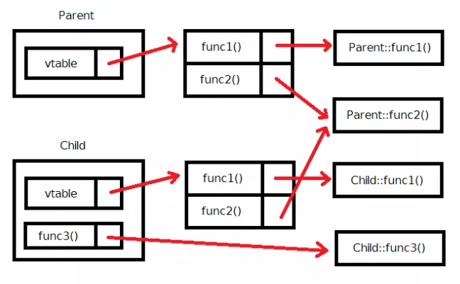

# Virtual 키워드

* `Virtual` 키워드가 달린 함수는 객체의 원형을 확인한 뒤 원래 객체의 함수로 반환한다.
* `동적 바인딩 (dynamic binding)` : 컴파일 시에 어떤 함수가 실행될 지 정해지지 않고 런타임 시에 정해지는 일
* `Virtual` 키워드가 붙은 함수를 가상함수 `(virtual function)` 이라고 한다. 파생 클래스의 함수가 기반 클래스의 함수를 오버라이드 하기 위해서는 두 함수의 꼴이 정확히 같아야 한다.
* 오버라이드하기 위한 함수에 `override` 키워드를 입력한다.


* 소멸자

```c++
#include <iostream>

class Parent {
  public:
    Parent() {std::cout << "Parent 생성자 호출"} << std::endl;}
    ~Parent() {std::cout << "Parent 소멸자 호출"} << std::endl;}
};
class Child : public Parent {
  public:
    Child() : Parent() {std::cout << "Child 생성자 호출" << std::endl;}
    ~Child() {std::cout << "Child 소멸자 호출" << std::endl;}
};
int main() {
    std::cout << "--- 평범한 Child 만들었을 때 ---" << std::endl;
    { Child c;}
    std::cout << "--- Parent 포인터로 Child 가리켰을 때 ---" << std::endl;
    {
        Parent* p = new Child();
        delete p;
    }
    return 0;
}
```

```powershell
--- 평범한 Child 만들었을 때 ---
Parent 생성자 호출
Child 생성자 호출
Child 소멸자 호출
Parent 소멸자 호출
--- Parent 포인터로 Child 가리켰을 때 ---
Parent 생성자 호출
Child 생성자 호출
Parent 소멸자 호출
```

* 이때, Parent의 소멸자를 virtual로 만들면 된다.

```c++
#include <iostream>

class Parent {
  public:
    Parent() {std::cout << "Parent 생성자 호출"} << std::endl;}
    Virtual ~Parent() {std::cout << "Parent 소멸자 호출"} << std::endl;}
};
class Child : public Parent {
  public:
    Child() : Parent() {std::cout << "Child 생성자 호출" << std::endl;}
    ~Child() {std::cout << "Child 소멸자 호출" << std::endl;}
};
int main() {
    std::cout << "--- 평범한 Child 만들었을 때 ---" << std::endl;
    { Child c;}
    std::cout << "--- Parent 포인터로 Child 가리켰을 때 ---" << std::endl;
    {
        Parent* p = new Child();
        delete p;
    }
    return 0;
}
```

```powershell
--- 평범한 Child 만들었을 때 ---
Parent 생성자 호출
Child 생성자 호출
Child 소멸자 호출
Parent 소멸자 호출
--- Parent 포인터로 Child 가리켰을 때 ---
Parent 생성자 호출
Child 생성자 호출
Child 소멸자 호출
Parent 소멸자 호출
```

* 상속될 여지가 있는 클래스들은 반드시 소멸자를 virtual로 만들어 주어야 한다.

* 전부 virtual 함수로 선언하면 발생하는 오버헤드

```c++
class Parent {
  public:
    virtual void func1();
    virtual void func2();
};
class Child : public Parent {
  public:
    virtual void func1();
    void func3();
};
```

* 컴파일러는 가상 함수가 하나라도 존재하는 클래스에 대해서, 가상함수 테이블(virtual function table; vtable)을 만들게 된다.



* 검사하는 과정이 거쳐지기 때문에 그런 과정에서 시간이 추가된다. 따라서, 최적화가 매우 중요한 분야에서는 이를 감안할 필요가 있다. 이런 이유로 c++ 에서는 멤버 함수가 디폴트로 가상함수가 되도록 설정하지 않는다.

* 순수가상함수(pure virtual function)와 추상 클래스(abstract class)

```c++
#include <iostream>

class Animal {
  public:
    Animal() {} // 순수가상함수를 1개 이상 가지고 있는 클래스를 추상 클래스 라고 부른다
    virtual ~Animal() {} // 반드시 오버라이딩 되어야 한다는 의미에서 순수가상함수
    virtual void spoeak() = 0; // Animal의 인스턴스를 생성 불가능함
};

class Dog : public Animal {
  public:
    Dog() : Animal() {}
    void speak() override {std::cout << "왈왈" << std::endl;}
};

class Cat : public Animal {
  public:
    Cat() : Animal() {}
    void speak() override {std::cout << "야옹야옹" << std::endl;}
};

int main() {
    Animal* dog = new Dog();
    Animal* cat = new Cat();
    
    dog->speak();
    cat->speak();
    
    return 0;
}
```

* 추상 클래스의 특징은 객체는 생성할 수 없지만, 추상 클래스를 가리키는 포인터는 문제 없이 만들 수 있다.


```c++
// 다중 상속
#include <iostream>

class A {
  public:
    int a;
    
    A() {std::cout << "A 생성자 호출" << std::endl;}
}

class B {
  public:
    int a;
    
    B() {std::cout << "B 생성자 호출" << std::endl;}
}

class C: public A, public b { // 상속 순서에 따라 호출자가 작동된다.
  public:
    int c;
    
    C(): A(), B() {std::cout << "A 생성자 호출" << std::endl;}
}

int main() {
    C c;
    return 0;
}
```

```powershell
A 생성자 호출
B 생성자 호출
C 생성자 호출
```

* `c.a = 3;` 이라는 명령을 실행 시켰을 때, A의 a인지 B의 a인지 알 수 없으므로 잘못된 접근이다.

```c++
class Human {
 public:
  // ...
};
class HandsomeHuman : public virtual Human {
  // ...
};
class SmartHuman : public virtual Human {
  // ...
};
class Me : public HandsomeHuman, public SmartHuman {
  // ...
}; // 다이아몬드 상속
```

* 다이아몬드 상속시  `virtual` 키워드를 통해 위의 문제를 해결한다. 다만, 가장 하위 객체는 부모 클래스의 생성자를 호출하는 것은 물론이고, 조상 클래스의 호출자도 호출하여야 한다.