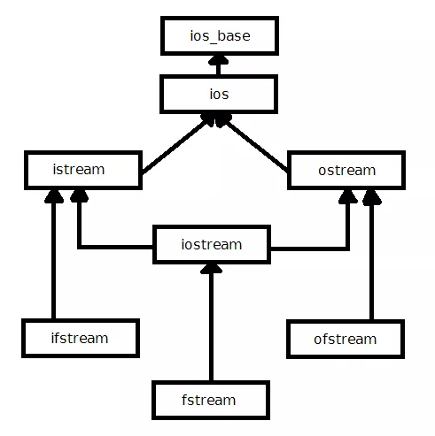

# 입출력

* C++의 입출력 라이브러리



* `ios_base` : 실수의 정밀도, 정수의 진법 등과 관련된 입출력 형식 관련 데이터 처리
* `ios` : 스트림 버퍼를 초기화. 하드에 한꺼번에 데이터를 읽거나 쓰는 일이 발생하면 처리 속도가 매우 느리기 때문에 버퍼에 보관한 후, 어느정도 모인 뒤에 출력함. 입출력 작업의 상태를 처리함.
* `istream` : 입력을 실제로 수행하는 클래스.
  * `goodbit` : 스트림에 입출력 작업이 가능할 때
  * `badbit` : 스트림에 복구 불가능한 오류 발생시
  * `failbit` : 스트림에 복구 가능한 오류 발생시
  * `eofbit` : 입력 작업시에 `EOF` 도달시

``` c++
#include <iostream>
#include <string>

int main() {
    int t;
    while (std::cin >> t) {
        std::cout << "입력 : " << t << std::endl;
        if(t==0) break;
    }
}
```

* `ios`에 정의되어 있는 함수들을 살펴보면 `operator void*() const` 가 있는 것을 확인할 수 있고, 이 함수는 `ios` 객체를 `void*` 로 변환해 준다. 단, 스트림에 정상적으로 입추력 작업을 수행 할 수 있을 때까지
* t 가 정수로 정의 되어 있으므로 정수형이 아닌 입력은 `ios 객체 -> void* -> bool`의 삼단 변화로 false를 반환한다.